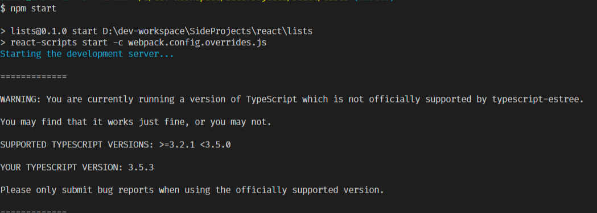
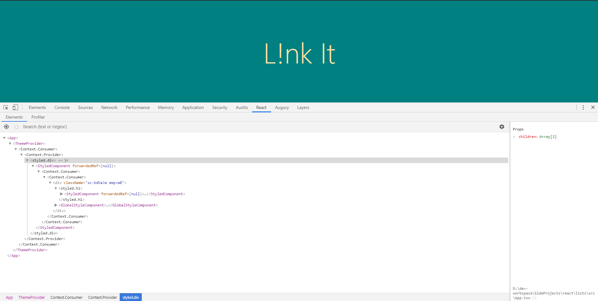

# Issues faced during development

## Using styled components' `ThemeProvider`

### Issue

### Resolution

After going to the definition of the `ThemeProviderProps` found a comment saying **_only one child is allowed_**. Moved every element inside `Wrapper` component nad used `Wrapper` as the _only_ child of `ThemeProvider`.

## While running unit tests with `ts-jest`

### Issue

Typescript Jest Tests run very slow.

### Resolution

Run `react-scripts test` _**`--maxWorkers=1`**_

### Ref

https://github.com/kulshekhar/ts-jest/issues/259#issuecomment-504088010

## TypeScript version mismatch for `typescript-estree`

### Issue

### Resolution

Installed `3.4.5` version of TypeScript.

## Styled Components + TypeScript - missing proper debugging

### Issue

### Resolution

Install `babel-plugin-macros` and import from `styled-components/macro`.

### Ref

https://www.styled-components.com/docs/tooling#babel-macro