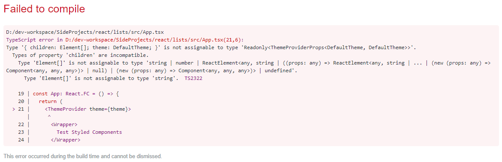

# Issues faced during development

## Using styled components' `ThemeProvider`

### Issue

### Resolution

After going to the definition of the `ThemeProviderProps` found a comment saying **_only one child is allowed_**. Moved every element inside `Wrapper` component nad used `Wrapper` as the _only_ child of `ThemeProvider`.